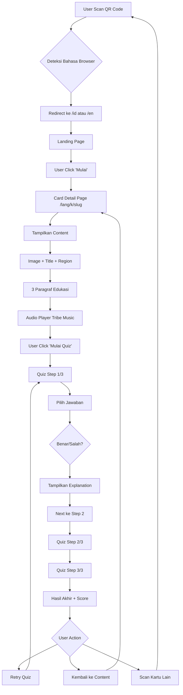
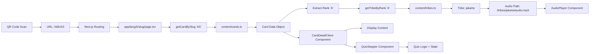

# 📖 Rangkuman Analisis Project CARDTARA

## 🎯 Deskripsi Project

**CARDTARA** (Kartu Budaya Nusantara) adalah aplikasi web interaktif edukatif yang menggabungkan kartu remi fisik dengan konten budaya Indonesia melalui teknologi QR Code. Setiap dari 52 kartu remi memiliki QR code unik yang ketika di-scan akan membuka halaman web berisi:

- 📖 Konten edukasi budaya Indonesia (teks, gambar, audio)
- 🎯 Quiz interaktif step-by-step (3 soal per kartu)
- 🌏 Dukungan dwi-bahasa (Indonesia & English)
- 📱 Desain mobile-first yang responsif

---

## 🏗️ Arsitektur Project

### Tech Stack

- **Framework**: Next.js 15 (App Router) dengan TypeScript 5.7
- **Styling**: Tailwind CSS 3.4
- **UI Component**: React 19
- **QR Generator**: qrcode 1.5.4
- **Deployment**: Optimized untuk Vercel
- **No Database**: Semua data stored locally dalam TypeScript files

### Struktur Folder

```
d:\Cardtara\
├── app/                          # Next.js App Router
│   ├── [lang]/                   # Dynamic route untuk bahasa (id/en)
│   │   ├── k/[slug]/             # Card detail pages
│   │   │   └── page.tsx          # Dynamic card page
│   │   ├── layout.tsx            # Language-specific layout
│   │   └── page.tsx              # Landing page dengan hero, features, how-it-works
│   ├── layout.tsx                # Root layout dengan Navbar & Footer
│   ├── page.tsx                  # Root redirect ke /id
│   ├── not-found.tsx             # Custom 404 page
│   └── globals.css               # Global styles + Tailwind
│
├── components/                   # React Components
│   ├── AudioPlayer.tsx           # HTML5 audio player (play/pause, skip, progress)
│   ├── CardDetailClient.tsx      # Client component: Card content + Quiz
│   ├── CardShell.tsx             # Card container wrapper
│   ├── Footer.tsx                # Footer dengan links
│   ├── HeroCard.tsx              # Hero card display
│   ├── LanguageSwitcher.tsx      # Toggle ID/EN dengan routing
│   ├── Navbar.tsx                # Navigation bar dengan logo & language switcher
│   ├── Progress.tsx              # Quiz progress bar
│   └── QuizStepper.tsx           # Main quiz logic (step-by-step, scoring)
│
├── content/                      # Data & Content
│   ├── cards.ts                  # Array data 52 kartu (bilingual content + quiz)
│   ├── tribes.ts                 # Data 13 suku Indonesia + mapping rank→tribe
│   └── utils.ts                  # Type definitions & utilities
│
├── lib/                          # Utilities
│   ├── cards.ts                  # Card data management (getCardBySlug, getAllCards)
│   └── i18n.ts                   # i18n utilities (locale validation, path builder)
│
├── public/                       # Static Assets
│   ├── media/                    # Card images & audio files
│   ├── qrs/                      # Generated QR codes (52 PNG files)
│   ├── tribes/                   # Tribe-specific audio (13 folders)
│   └── *.jpg/png                 # Background images
│
├── scripts/
│   └── generate-qr.ts            # Script untuk generate 52 QR codes
│
├── package.json                  # Dependencies
├── next.config.ts                # Next.js config
├── tailwind.config.ts            # Tailwind custom theme (Nusantara colors)
├── tsconfig.json                 # TypeScript config
├── AUDIO_SETUP.md                # Dokumentasi sistem audio
└── README.md                     # Dokumentasi lengkap
```

---

## ✨ Fitur-Fitur Utama

### 1️⃣ **Sistem Kartu & QR Code**

- **52 Kartu Remi**: Setiap kartu (AS, 2S, ..., KH, dll) punya konten budaya unik
- **Tribe-Based System**: 13 rank kartu → 13 suku Indonesia
  - Contoh: Rank A (Ace) → Jakarta Betawi (4 kartu: AS, AH, AD, AC)
  - Rank 2 → Minangkabau (4 kartu: 2S, 2H, 2D, 2C)
  - Dan seterusnya...
- **QR Code Generation**: Script otomatis `npm run generate:qr` untuk membuat 52 QR codes (300x300px PNG)

### 2️⃣ **Konten Edukasi Bilingual**

Setiap kartu memiliki:
- **Judul** (Indonesia & English)
- **Region** (Daerah asal)
- **3 Paragraf** konten edukasi (bilingual)
- **Gambar** (WebP format, optimized)
- **Audio** (MP3, tribe-specific background music)

### 3️⃣ **Sistem Audio Berbasis Suku**

- **13 Suku → 13 Audio Files**: Setiap tribe punya musik tradisional sendiri
- **Path Structure**: `/tribes/{slug}/audio.mp3`
  - `/tribes/jakarta/audio.mp3` → Gambang Kromong
  - `/tribes/minang/audio.mp3` → Saluang, Talempong
  - `/tribes/bali/audio.mp3` → Gamelan Bali
- **Smart Mapping**: Card slug (AS) → Rank (A) → Tribe (jakarta) → Audio path
- **Audio Player**: Full-featured HTML5 player dengan play/pause, skip ±10s, progress bar

### 4️⃣ **Quiz Interaktif Step-by-Step**

Setiap kartu punya **3 soal quiz** dengan:
- **Step-by-step Flow**: Satu soal per halaman, bukan semua sekaligus
- **Multiple Choice**: 4 pilihan (A, B, C, D)
- **Instant Feedback**: Jawaban benar/salah langsung ditampilkan
- **Explanation**: Setiap soal ada penjelasan setelah dijawab
- **Scoring System**: Skor final + feedback (Sempurna!/Bagus!/Coba Lagi!)
- **Retry Option**: Bisa mengulang quiz

**Quiz Flow**:
```
Content View → Start Quiz 
  → Question 1 + Answer → Explanation → Next
  → Question 2 + Answer → Explanation → Next  
  → Question 3 + Answer → Explanation → Next
  → Results (Score 2/3) → Retry or Back
```

### 5️⃣ **Dukungan Multi-Bahasa (i18n)**

- **URL-based Routing**: `/id/k/AS` vs `/en/k/AS`
- **Locales**: `id` (Indonesia) dan `en` (English)
- **Default Locale**: Indonesia (`id`)
- **Language Switcher**: Toggle button di navbar untuk ganti bahasa
- **Semua Konten Bilingual**: 
  - Landing page (hero, features, CTA)
  - Card content (title, paragraphs, region)
  - Quiz (questions, choices, explanations)
  - UI labels (buttons, navigation)

### 6️⃣ **Landing Page**

Halaman utama dengan sections:
- **Hero Section**: Banner dengan CTA "Mulai" & "Scan Kartu"
- **Features Section**: 3 kartu fitur (Batik, Wayang, Digital Folklore)
- **How It Works**: Step-by-step guide + video demo placeholder
- **CTA Section**: Call-to-action "Siap Memulai?"

### 7️⃣ **UI/UX Nusantara Theme**

**Color Palette**:
- Primary: `#4F46E5` (Indigo)
- Accent: `#B91C1C` (Brick Red) - untuk burgundy theme
- Gold: `#F59E0B` (highlights)
- Success: `#10B981` (Pandan Green)
- Background: `#FEF3C7` (Cream)

**Design Elements**:
- Batik patterns overlay
- Wayang silhouettes sebagai divider
- Mobile-first responsive design
- Smooth transitions & hover effects

---

## 🔄 Flow Aplikasi

### User Journey



### Technical Flow



---

## 📊 Data Structure

### Card Data Type

```typescript
interface Card {
  slug: string;              // "AS", "2H", "KD", etc
  cardName: string;          // "Ace of Spades"
  tribe: string;             // "jakarta", "minang", etc
  title: {
    id: string;              // Judul Indonesia
    en: string;              // English title
  };
  region: {
    id: string;              // Region Indonesia
    en: string;              // Region English
  };
  paragraphs: {
    id: string[];            // 3 paragraf Indonesia
    en: string[];            // 3 paragraf English
  };
  image: string;             // "/media/as.webp"
  audio: string;             // "/media/as.mp3" (deprecated, diganti tribe audio)
  quiz: QuizQuestion[];      // Array 3 soal
}

interface QuizQuestion {
  q: { id: string; en: string };           // Pertanyaan
  choices: { id: string[]; en: string[] }; // 4 pilihan
  answerIndex: number;                      // Index jawaban benar (0-3)
  explain: { id: string; en: string };     // Penjelasan
}
```

### Tribe Data Type

```typescript
interface TribeInfo {
  slug: string;              // "jakarta", "minang", etc
  name: {
    id: string;              // "Betawi Jakarta"
    en: string;              // "Jakarta Betawi"
  };
  audioPath: string;         // "/tribes/jakarta/audio.mp3"
}
```

### Rank to Tribe Mapping

```typescript
const rankToTribe = {
  "A": "jakarta",    // Ace → Jakarta (4 cards)
  "2": "minang",     // 2 → Minangkabau
  "3": "papua",      // 3 → Papua
  "4": "jabar",      // 4 → Jawa Barat
  "5": "jateng",     // 5 → Jawa Tengah
  "6": "jatim",      // 6 → Jawa Timur
  "7": "baduy",      // 7 → Baduy
  "8": "dayak",      // 8 → Dayak
  "9": "bugis",      // 9 → Bugis
  "10": "toraja",    // 10 → Toraja
  "J": "bali",       // Jack → Bali
  "Q": "sasak",      // Queen → Sasak
  "K": "gayo",       // King → Gayo
};
```

---

## 🎨 Komponen React

### 1. **CardDetailClient.tsx** (Client Component)
- **Purpose**: Main component untuk card detail page
- **Features**:
  - Display card content (image, title, region, paragraphs)
  - Integrate AudioPlayer dengan tribe audio
  - State management untuk toggle antara content view & quiz view
  - Responsive design
- **Key State**: `showQuiz` (boolean)

### 2. **QuizStepper.tsx** (Client Component)
- **Purpose**: Handle entire quiz flow
- **Features**:
  - Step-by-step navigation (1 soal per screen)
  - Answer selection & validation
  - Instant feedback (correct/incorrect)
  - Progress tracking
  - Score calculation
  - Result screen dengan retry option
- **Key States**:
  - `currentStep` (0-2): Current question index
  - `selectedAnswers` (array): User's answers
  - `isAnswered` (boolean): Current question answered?
  - `showResult` (boolean): Show final result?

### 3. **AudioPlayer.tsx** (Client Component)
- **Purpose**: Full-featured HTML5 audio player
- **Features**:
  - Play/Pause button
  - Skip backward/forward (±10s)
  - Progress bar (seekable)
  - Time display (current/duration)
  - Responsive controls
- **Key States**: `isPlaying`, `currentTime`, `duration`

### 4. **Navbar.tsx** (Server Component)
- **Purpose**: Top navigation bar
- **Features**:
  - Logo "CARDTARA"
  - Language switcher component
  - Responsive mobile menu (potential)
  - Sticky positioning

### 5. **LanguageSwitcher.tsx** (Client Component)
- **Purpose**: Toggle bahasa Indonesia ↔ English
- **Features**:
  - Button toggle style
  - Auto-redirect ke URL yang sama dengan locale berbeda
  - Visual indicator (active language highlighted)

### 6. **Footer.tsx**, **Progress.tsx**, **CardShell.tsx**, **HeroCard.tsx**
- Supporting components untuk UI structure

---

## 🚀 Scripts & Commands

| Command | Fungsi |
|---------|--------|
| `npm run dev` | Development server (localhost:3000) dengan Turbo |
| `npm run build` | Build production bundle (static generation) |
| `npm start` | Run production server |
| `npm run lint` | Run ESLint |
| `npm run generate:qr` | Generate 52 QR codes ke `/public/qrs/` |

---

## 📱 Deployment & Production

### Static Site Generation (SSG)
- Next.js akan generate **104 static pages** saat build:
  - 52 kartu × 2 bahasa (id, en) = 104 halaman
  - `/id/k/AS`, `/id/k/2S`, ..., `/en/k/AS`, `/en/k/2S`, dst
- Super fast, no server-side rendering needed
- Perfect untuk Vercel deployment

### Environment Variables
```bash
NEXT_PUBLIC_BASE_URL=https://cardtara.vercel.app
```
- Used untuk QR code generation
- Ganti dengan domain production sebelum generate QR untuk cetak fisik

---

## ✅ Status Project Saat Ini

### ✅ **Sudah Selesai**
- ✅ Struktur project & setup Next.js 15
- ✅ Routing system dengan dynamic locale & slug
- ✅ System tribe-based audio (13 tribes)
- ✅ Quiz interaktif step-by-step penuh
- ✅ Audio player fungsional
- ✅ Multi-language routing (id/en)
- ✅ Landing page dengan hero & features
- ✅ QR code generation script
- ✅ Tailwind custom theme Nusantara
- ✅ Responsive design mobile-first
- ✅ **3 kartu dummy** dengan konten lengkap (AS, 2S, KH)

### 🚧 **Belum/Masih Kurang**
- 🚧 **Konten**: Baru 3 dari 52 kartu yang ada data lengkap
- 🚧 **Audio Files**: Folder `/public/tribes/` belum ada file MP3 actual
- 🚧 **Card Images**: Belum semua kartu ada gambar `/media/`
- 🚧 **QR Files**: Belum di-generate (run `npm run generate:qr`)
- 🚧 **Testing**: Belum ada unit/integration tests
- 🚧 **SEO**: Meta tags bisa lebih optimal
- 🚧 **Analytics**: Belum ada tracking

### 📝 **TODO Next Steps** (dari README)
- [ ] Tambah semua 52 kartu dengan konten lengkap
- [ ] Upload 13 tribe audio files (MP3)
- [ ] Generate QR codes untuk production
- [ ] Optional: Scanner QR via browser
- [ ] Optional: Save skor ke localStorage
- [ ] Optional: Sound effects untuk quiz
- [ ] Optional: Analytics tracking
- [ ] Optional: Print-ready card templates (PDF)

---

## 🎯 Kesimpulan

**CARDTARA** adalah project web app edukatif yang **sangat well-structured** dengan:

### 👍 **Kekuatan**
1. **Arsitektur Modern**: Next.js 15 App Router, TypeScript, best practices
2. **Scalable**: Mudah extend dari 3 ke 52 kartu, tinggal tambah data
3. **Bilingual**: i18n system yang clean dan maintainable
4. **Interactive**: Quiz step-by-step dengan UX yang smooth
5. **Cultural**: Sistem tribe-based audio yang unik dan autentik
6. **Mobile-First**: Responsif untuk smartphone (target utama)
7. **Documentation**: README & AUDIO_SETUP sangat detail
8. **No Database**: Simple deployment, no backend needed

### 🎨 **Use Case**
- 🎓 **Edukasi**: Pelajar belajar budaya Indonesia dengan fun
- 🧳 **Tourism**: Wisatawan mengenal keberagaman Nusantara
- 🎴 **Cultural Preservation**: Melestarikan budaya lewat teknologi
- 🎁 **Gift Product**: Bisa jadi souvenir premium Indonesia

### 🔮 **Potensi Development**
Project ini punya fondasi solid untuk dikembangkan lebih lanjut:
- Tambah lebih banyak konten budaya per kartu
- AR/VR integration untuk pengalaman immersive
- Gamification dengan leaderboard & badges
- Community features (share quiz results)
- E-commerce untuk jual kartu fisik

---

**🇮🇩 Lestarikan budaya, satu kartu pada satu waktu! ✨**
